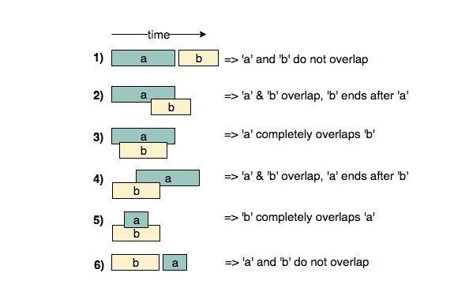
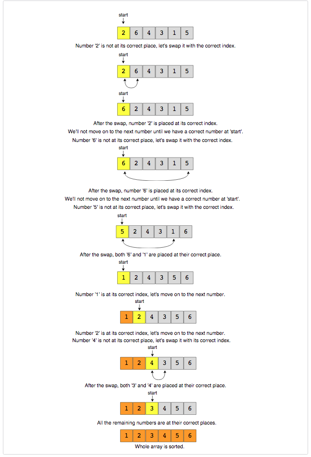

<h1 align=center> The Software Engineering Interview </h1> <!-- omit in toc -->

<h3> Table of Contents </h3> <!-- omit in toc -->

1. [Data Structures](#data-structures)
   1. [Graphs](#graphs)
   2. [Trees](#trees)
   3. [Heaps](#heaps)
   4. [Disjoint Sets](#disjoint-sets)
   5. [Tries](#tries)
   6. [Linked Lists](#linked-lists)
2. [Algorithms](#algorithms)
   1. [Patterns](#patterns)
      1. [Sliding Window](#sliding-window)
      2. [Two Pointers](#two-pointers)
      3. [Fast & Slow Pointers](#fast--slow-pointers)
      4. [Merge Intervals](#merge-intervals)
      5. [Cyclic Sort](#cyclic-sort)
      6. [Reversal of a Linked List](#reversal-of-a-linked-list)
      7. [BFS](#bfs)
      8. [DFS](#dfs)
      9. [2 Heaps](#2-heaps)
      10. [Subsets](#subsets)
      11. [Binary Search](#binary-search)
      12. [Bitwise XOR](#bitwise-xor)
      13. [Top K Elements](#top-k-elements)
      14. [K-Way Merge](#k-way-merge)
      15. [Backtracking](#backtracking)
      16. [Graph Algorithms](#graph-algorithms)
      17. [Dynamic Programming](#dynamic-programming)
   2. [Sorting](#sorting)
      1. [Mergesort](#mergesort)
      2. [Quicksort](#quicksort)
      3. [Insertion sort](#insertion-sort)
      4. [Selection sort](#selection-sort)
      5. [Bubble sort](#bubble-sort)
      6. [Heap sort](#heap-sort)
      7. [Bucket Sort](#bucket-sort)
3. [System Design](#system-design)
   1. [High-level Process](#high-level-process)
   2. [Caching](#caching)
   3. [Data Partitioning](#data-partitioning)
   4. [CAP Theorem](#cap-theorem)
   5. [Consistent Hashing](#consistent-hashing)
   6. [Load Balancing](#load-balancing)
   7. [Distributed Systems](#distributed-systems)
   8. [Miscellaneous](#miscellaneous)
4. [Big-O](#big-o)
5. [Bit Manipulation](#bit-manipulation)
6. [Dynamic Programming](#dynamic-programming-1)
7. [Languages](#languages)
   1. [Python](#python)
      1. [Dictionaries](#dictionaries)
      2. [Heapq](#heapq)
      3. [Counter](#counter)
      4. [Decorators](#decorators)
      5. [Iterators & Generators](#iterators--generators)
      6. [Sets](#sets)
      7. [itertools](#itertools)
      8. [I/O](#io)
      9. [args and kwargs](#args-and-kwargs)
      10. [Dataclasses](#dataclasses)
      11. [Miscellaneous](#miscellaneous-1)
   2. [SQL](#sql)
      1. [ACID vs. BASE](#acid-vs-base)
      2. [Indexing](#indexing)
      3. [NoSQL](#nosql)
8. [OSI Model](#osi-model)
9. [Powers of 10](#powers-of-10)
10. [Powers of 2](#powers-of-2)
11. [Miscellaneous](#miscellaneous-2)
12. [Coding Assessment](#coding-assessment)
13. [Resources](#resources)

## Data Structures

### Graphs

#### Terminology <!-- omit in toc -->

- **Weighted graph**: A graph which has values associated with its edges
- **Vertex cut**: The set of vertices whose removal would make graph disconnected
- **Degree**: Denotes the number of edges connected to a certain node
  - In a directed graph, this is further broken down into **indegree** and **outdegree**
- **Hamiltonian path**: A path that visits each vertex exactly once
- **Hamiltonian cycle/circuit**: A path that is a cycle

#### Types <!-- omit in toc -->

1. **Directed graph (digraph)**: A graph whose edges have an explicit direction
   - Implies that relations between vertices is not always symmetric
2. **Directed acylic graph (DAG)**: A digraph with no directed cycles
   - Enables a [**topological sorting**](#topological-sorting) of vertices
     - Any DAG has a minimum of one topological ordering
   - Ideal for scheduled systems of events
     - Vertices of graph may represent tasks to be performed & thus the edges would represent constraints that task `A` must be performed before task `B`
3. **Connected graph**: A graph with no isolated vertices
   - A **connected component** is one that is internally connected but _not_ connected to the vertices of the rest of supergraph
   - In BFS/DFS, if the number of nodes visited is equal to the total number of vertices then the graph can be considered connected
4. **Strongly-connected digraph**: A graph in which every pair of vertices has a directed _path_ both from `x` to `y` and `y` to `x`, weakly connected otherwise
   1. Strongly-connected components:

  <p align="center">
    
  </p>

#### Implementation <!-- omit in toc -->

1. **Adjacency list**
   - A hashmap whose keys are vertices and values are an unordered list of the neighbors of a vertex
   - More efficient than a matrix in regards to fetching a given vertex's neighbors - `O(1)` lookup
     - Less efficient for ascertaining if 2 vertices are neighbors - `O(|V|)` lookup
     - Slow to remove a vertex/edge because the entire map must be iterated over to remove any instances

 <p align="center">
    
  </p>

2. **Adjacency matrix**
   - Each (non-diagonal) entry `A`<sub>`ij`</sub> is equal to the number of edges from vertex `i` to vertex `j`
     - Entries can also be booleans if the graph is parallel (directed path in both directions)
   - In a graph without loops, the diagonal values in the matrix are `0`
   - Space efficient (1 bit per entry)
   - `O(1)` time to check if any 2 vertices are neighbors
   - Slow to add/remove vertices because the matrix will necessarily need to be resized/updated

 <p align="center">
    
  </p>

### Trees

A tree is an _undirected_ graph in which any two vertices are connected by _exactly_ one _path_ (not edge). In other words, a tree is an undirected graph without cycles.

#### Terminology <!-- omit in toc -->

- **Depth**: the number of edges from the root node to a node `n` (a root has a depth of `0`)
- **Height**: the number of edges from a node `n` to its _deepest_ leaf (a leaf has a height of `0`)

#### Traversals <!-- omit in toc -->

- Pre-order: Visit the _left_ side of each node
- In-order: Visit the _bottom_ of each node
- Post-order: Visit the _right_ side of each node

<p align="center">
  
</p>

#### Implementations <!-- omit in toc -->

##### Binary Trees

- **Full tree**: every node (aside from the leaves) has either `0` or `2` children
- **Complete tree**: Every level (except the last, potentially) is completely filled and all nodes are as far left as possible
- **Perfect tree**: A tree which is full and **wholly** complete e.g. last level is entirely filled
- **Balanced tree**: A tree in which the heights of any left and right sub-trees differ by no more than 1
- **Tree rotation**: An operation that changes the tree structure _without_ affecting the original order of the nodes

##### Binary Search Trees

Binary trees which have an additional sorting constraint such that **all** nodes of a left sub-tree are lesser than the root and **all** nodes of the right sub-tree are greater. This also implies that an inorder traversal of such a tree will print nodes in a sorted, ascending order.

- BSTs have a performance that's proportional to its height
  - Therefore, a smaller height is algorithmically preferable
  - Balanced trees have a height of `O(logN)` for `N` nodes
    - The worst case scenario for an unbalanced tree can be `O(N)`

###### Red-Black Trees

There are 4 main properties intrinsic to Red-Black trees:

1. Each node is either **red** or **black**
   - How the tree is "painted" ensures its balance
   - Tree is constantly re-painted to maintain its red-black properties
2. Root & all leaves are black
   - Leaf nodes have no data
3. If a node is red, then both of its children are black
4. Every path from a given node to its descendant leaves has the same number of black nodes (not counting the original node)
   - Therefore, there exists a black height for every node denoted as `bh(n)`

These properties thus reveal an axiom that a path from the root node to its _farthest_ leaf node is _no more than twice as long_ as the path from the root node to its _nearest_ leaf node (shortest path is entirely black nodes while the longest is of alternating colors). This ensures the tree is roughly height-balanced and therefore optimally efficient.

###### AVL trees

A self-balancing binary search tree in which each node maintains extra information called a balance factor whose value is either `-1`, `0` or `+1`.

- Balance factor of a node in an AVL tree is the difference between the height of the left subtree and that of the right subtree
- More stringent balancing than that of a Red-Black tree
  - Slower insertion & removal, faster search
- The heights of two subtrees from any node differ at most by `1`
  - If at any point the heights differ by more than `1`, a rebalancing is performed via tree rotations

##### Spanning Tree

A sub-graph of an undirected, connected graph which includes **all** vertices of the supergraph, trimmed down to contain the absolute _minimum number of edges_. The total number of spanning trees with `n` vertices that can be created from a complete graph is equal to `n`<sup>`(n-2)`</sup>.

###### Minimum Spanning Tree

A minimum spanning tree is a logical extension of a spanning tree. The only difference is that, for a minimum spanning tree, **weighted edges** are taken into account to derive the global minimum cost required to connect all vertices.

Algorithms:

1. [Kruskal's Algorithm (vertices)](#kruskals-algorithm)
2. [Prim's Algorithm (edges)](#prims-algorithm)

###### Shortest Path Tree

Given a connected, directed graph `G`, a shortest-path tree rooted at vertex `v` is a spanning tree `T` of `G`, such that the path distance from root `v` to any other vertex `u` in `T` is the shortest path distance from `v` to `u` in `G`.

A key component in SPTs, edge relaxation is the method by which the shortest path is able to be derived. Starting from the source node `v`, all adjacent nodes' weights are catalogued into one comprehensive table. Any non-adjacent node is marked as having a weight of positive infinity.

On each iterative visit of the next-closest vertex `u`, the paths to every other vertex is re-calculated from `u`. If this recalculation leads to a lesser-weighted path to any vertex `w` within the table, then the weight of that edge is updated to reflect that new, lesser value.

Once the next-closest vertex is determined, that node is visited and the cycle repeats. Eventually, once all the nodes have been visited, the table will contain a shortest path value from a source vertex `v` to _every other node_ in the graph.

Note: An SPT is **not** guaranteed to be an MST. An SPT guarantees that any node `u` will have a _locally_ optimized minimal path in regards to the _source_ node `v`, whereas an MST guarantees a _globally_ optimal cost to connect all vertices (without taking a source node into consideration).

Algorithms:

1. [Dijkstra's Algorithm](#dijkstras-algorithm)
2. [Bellman-Ford's Algorithm](#bellman-fords-algorithm)

### Heaps

A **complete binary tree** that satisfies the property that for any given node `n`, its children nodes are either lesser or greater than `n`.

When represented as an array:

- Children live at indices `2i+1` (left child) and `2i+2` (right child)
- Parent lives at `(i-1)//2`

```python
def heapify(arr, n, i):
      # Find largest among root and children
      largest = i
      l = 2 * i + 1
      r = 2 * i + 2

      if l < n and arr[i] < arr[l]:
          largest = l

      if r < n and arr[largest] < arr[r]:
          largest = r

      # If root is not largest, swap with largest and continue heapifying
      if largest != i:
          arr[i], arr[largest] = arr[largest], arr[i]
          heapify(arr, n, largest)


  def heapSort(arr):
      n = len(arr)

      # Build max heap
      for i in range(n//2, -1, -1):
          heapify(arr, n, i)

      for i in range(n-1, 0, -1):
          # Swap
          arr[i], arr[0] = arr[0], arr[i]

          # Heapify root element
          heapify(arr, i, 0)


  arr = [1, 12, 9, 5, 6, 10]
  heapSort(arr)
```

#### Fibonacci Heaps <!-- omit in toc -->

A fibonacci heap is a data structure that consists of a collection of trees which follow min-heap or max-heap property. In this structure, a node can have any amount of children except one. It is constructed in such a way that a tree of order `n` has at least `F`<sub>`n+2`</sub> nodes in it, where `F`<sub>`n+2`</sub> is the `(n+2)`<sup>th</sup> Fibonacci number.

##### Properties

1. It is a set of min/max-heap-ordered trees
2. A pointer is maintained at the minimum element node
3. It consists of a set of marked nodes
4. The trees within are unordered but rooted

<p align="center">
  
</p>

##### Memory

The roots of all trees are linked together for quick access. The children nodes are then connected to one another via a doubly-linked list.

<p align="center">
  
</p>

##### Complexity

- `O(1)` insertions, unions, key decreases, and min-finds
- `O(logn)` min extraction and node deletion

### Disjoint Sets

An abstract data structure that is concerned with the connectivity between components of a given network. Disjoint sets do not contain cycles, therefore they can be represented as trees.

#### Functions <!-- omit in toc -->

- `find(vertex)`

- `union(vertex1, vertex2)`

#### General Algorithm <!-- omit in toc -->

1. Initialize an array of size `V`, where `V` is the total number of vertices
   1. For each index, assign its value to that of the node it's representing
2. Iterate through a list of edges
3. Check whether the vertices of these edges belong to the same disjoint set
4. If not, union the vertices by updating the array to reflect the new set association
5. Continue iterating through the rest of the edges

#### Basic Implementations <!-- omit in toc -->

##### Quick Find

1. `O(1)` lookups but unions have a time complexity of `O(N)`
2. _Each_ index in the array is assigned to the root node of its corresponding set
3. Therefore, looking up whether two nodes belong to a set is trivial `return find(x) == find(y)`
4. Unions, however, necessitate all nodes in the joinee set to be updated with a new root value

```python
def __init__(self, size):
  self.root = [i for i in range(size)]

def find(self, x):
  return self.root[x] #efficient

def union(self, x, y):
  rootX = self.find(x)
  rootY = self.find(y)

  if rootX != rootY:
    for i in range(len(self.root)): #inefficient
      if self.root[i] == rootY:
        self.root[i] = rootX
```

##### Quick Union

1. `O(logN)` unions **and** finds
2. Each _parent_ index in the array is assigned to another parent index
3. Therefore, finding whether two vertices belong to a set takes a bit longer. `find(x), find(y)` has to access the index of `x` and `y`, and if its values are not not equal, it continually travels up their lineages until it finds their respective root nodes
4. Unions, on the other hand, are very efficient. To union two sets, the parent node of `set2` is the sole node that needs to be updated in the array

```python
def __init__(self, size):
  self.root = [i for i in range(size)]

def find(self, x):
  while x != self.root[x]: #inefficient
    x = self.root[x]
  return x

def union(self, x, y):
  rootX = self.find(x)
  rootY = self.find(y)

  if rootX != rootY:
    self.root[rootY] = rootX #efficient
```

<p align="center">
  
</p>

##### Optimizations

There are 2 main optimizations we can implement into the disjoint set union algorithm:

###### Union by Rank

1. An extension of quick-union, union by rank provides optimizations for `union()`
2. Serves to limit the maximum height of each set
3. When unioning two vertices, instead of picking either the root of `x` or `y` at random (as in quick union), the root of the vertex with the lesser "rank" is chosen as the unionee
   1. Ranks are determined by tree height
   2. Thus, the "smaller" tree is merged into the larger and the possibility of creating a set that mimics a linked-list (`O(N)`) structuring is reduced
4. The general concept is that the array structure should represent a tree in order for the time complexity to be reduced down to a logarithmic time complexity
   1. Less parent nodes, less iterations

```python
def __init__(self, size):
  self.root = [i for i in range(size)]
  self.rank = [1] * size

def find(self, x):
  while x != self.root[x]:
    x = self.root[x]
  return x

def union(self, x, y):
  rootX = self.find(x)
  rootY = self.find(y)

  if rootX != rootY:
    if self.rank[rootX] > self.rank[rootY]:
      self.root[rootY] = rootX
    elif self.rank[rootX] < self.rank[rootY]:
      self.root[rootX] = rootY
    else:
      self.root[rootY] = rootX
      self.rank[rootX] += 1 # union by rank
```

###### Union with Path Compression

1. This optimization leverages the fact that the parent node of a parent node must be computed in order to find a node's given root
2. Since these computations are made along the entire length of the branch up to the root, the branch as a whole can be compressed
   1. The individual nodes composing this branch can be directly assigned to their ancestral root node rather than their respective parents
   2. This mimics the functionality in the Quick Find implementation and grants a best `O(1)` lookup time, `O(logN)` on average

```python
def __init__(self, size):
  self.root = [i for i in range(size)]

def find(self, x):
  while x != self.root[x]: # optimization
    self.root[x] = self.find(self.root[x])
  return self.root[x]

def union(self, x, y):
  rootX = self.find(x)
  rootY = self.find(y)

  if rootX != rootY:
    self.root[rootY] = rootX
```

###### Quick Union with All Optimizations

```python
def __init__(self, size):
  self.root = [i for i in range(size)]
  self.rank = [1] * size

def find(self, x):
  while x != self.root[x]:
    self.root[x] = self.find(self.root[x])
  return self.root[x]

def union(self, x, y):
  rootX = self.find(x)
  rootY = self.find(y)

  if rootX != rootY:
    if self.rank[rootX] > self.rank[rootY]:
      self.root[rootY] = rootX
    elif self.rank[rootX] < self.rank[rootY]:
      self.root[rootX] = rootY
    else:
      self.root[rootY] = rootX
      self.rank[rootX] += 1
```

### Tries

- Nodes do not store keys, but rather their position within the trie defines the key
  - e.g. They typically only store a character and the full string is built via depth traversal
- They typically store a boolean value representing whether said node signifies the end of a word
- Implemented as a `dictionary` of dictionaries
- `O(N)` lookup where `N` is the length of the word
- `O(M*N)` space complexity, for `M` words of length `N`

<p align="center">
  
</p>

### Linked Lists

- Fast, slow pointers
  - Both start at the head but one pointer jumps 2 nodes at a time, the other just 1
  - When `fast == slow`, then a cycle exists
  - **To find the length of the cycle**, move one of the pointers one-at-a-time until `fast == slow` again
  - **To find the start of the cycle**, start 2 pointers at the `root`, move 1 pointer ahead by the cycle length, then increment both by 1 until `ptr1 == ptr2`

## Algorithms

### Patterns

---

#### Quick reference <!-- omit in toc -->

| Problem                                       | Pattern                   |
| --------------------------------------------- | ------------------------- |
| Sorted array                                  | Binary search, 2 pointers |
| Permutations, subsets, all possible solutions | Backtracking              |
| Recursion not permitted                       | Stack                     |
| Max/min subarray, subset                      | Dynammic Programming      |
| Top, least K items                            | Heap                      |
| Common strings                                | Map, trie                 |
| Anything else                                 | Hash table, set           |

#### Sliding Window

- Ideal when the objective is to calculate something among subsets of an array or list
  - e.g. Given an array, find the average of all contiguous subarrays of size `K`
- Can reuse previous window calculation by simply removing the element that is exiting the window upon the next iteration - `O(n)`

```python
def find_averages_of_subarrays(arr, k):
  results = []
  windowSum = 0
  windowStart = 0

  for windowEnd in range(arr.length):
    windowSum += arr[windowEnd]

    if windowEnd >= k - 1:
      results.append(windowSum/k)
      windowSum -= arr[windowStart]
      windowStart += 1

  return results
```

#### Two Pointers

- Ideal for sorted arrays/linked lists or finding a set (pair, triplet, subarray) of elements that fit a certain constraint
- e.g. Squaring a sorted array, finding a triplet that sum to 0

```python
def remove_element(arr: List[int], key: int) -> int:
  nextElement = 0

  for val in range(len(arr)):
    if val != key:
      arr[nextElement] = val
      nextElement += 1

  return nextElement
```

#### Fast & Slow Pointers

- Typically reserved for cyclical arrays and linked lists
- e.g. Identifying palindromes, cycles

```python
def has_cycle(head: Optional[ListNode]) -> bool:
 slow = fast = head

 while fast and fast.next:
  fast = fast.next.next
  slow = slow.next

  if fast == slow:
   return True
 return False
```

```python
def find_happy_number(num):
  slow = num
  fast = num

  while True:
    slow = find_square_sum(slow)
    fast = find_square_sum(find_square_sum(fast))
    if slow == fast: break

  # check if the cycle is stuck on the number 1
  return slow == 1

def find_square_sum(num):
  sum = 0
  while num > 0:
    digit = num % 10
    sum += digit * digit
    num //= 10
  return sum
```

#### Merge Intervals

- Relevant for any problem involving overlapping intervals
  - Can be either finding these intervals or merging them
- If there are 2 intervals `A` and `B`, there are 6 outcomes:

<p align="center">
  
</p>

```python
class Interval:
  def __init__(start, end):
    this.start = start
    this.end = end

def merge(intervals):
  if len(intervals) < 2:
    return intervals

  intervals.sort(lambda x: x.start)
  mergedIntervals = []

  start = intervals[0].start
  end = intervals[0].end

  for i in range(1, len(intervals)):
    interval = intervals[i]

    if interval.start <= end:
      end = max(interval.end, end)
    else:
      mergedIntervals.append(Interval(start, end))
      start = interval.start
      end = interval.end

  mergedIntervals.append(Interval(start, end))
  return mergedIntervals
```

#### Cyclic Sort

- Ideal for arrays containing numbers in a given range
- Iterates through array to identify any misplaced values and then placing them into their correct position
- e.g. Given an array of unsorted numbers 1 to `n` (duplicates allowed), find the missing number. We can sort by placing `1` at index `0`, 2 at `1`, etc. and then iterate again to find missing number

<p align="center">
  
</p>

```python
def cyclic_sort(nums):
  i = 0

  while i < nums.length:
    index = nums[i] - 1

    if nums[i] != nums[index]:
      nums[i], nums[index] = nums[index], nums[i]
    else:
      i += 1
  return nums
```

#### Reversal of a Linked List

- Reversing a linked list using existing nodes i.e. no extra memory is used

```python
def reverse(head):
  current = head
  previous = None

  while current:
    next_node = current.next
    current.next = previous
    previous = current
    current = next_node

  return previous
```

#### BFS

- Optimal choice for any problem involving traversal of a tree level-by-level
- Ideal for finding the shortest path between two vertices in a graph whose edges have _equal_ and _positive_ weights.
- Implemented via **queues**
- `O(V)` space complexity where `V` is equal to the number of nodes
- `O(V + E)` time complexity, where `E` is equal to the number of edges

```python
def bfs(graph, root):
  visited, queue = set(), deque([root])
  visited.add(root)

  while queue:
    vertex = queue.popleft()

    for neighbour in graph[vertex]:
      if neighbour not in visited:
        visited.add(neighbour)
        queue.append(neighbour)

  return visited
```

#### DFS

- Implemented via **stacks** or **recursion**
  1. Start at root node
  2. Perform null check
  3. Make recursive call to children
  4. Perform operations on node
- `O(V)` space complexity
- `O(V + E)` time complexity

```python
def dfs(graph, start, visited=None):
  if visited is None:
    visited = set()
  visited.add(start)

  for next_node in graph[start]:
    if next_node not in visited:
      dfs(graph, next_node, visited)

  return visited
```

```python
# Given a binary tree and a number ‘S’, 
# find if the tree has a path from root-to-leaf such that the sum of all the node values of that path equals ‘S’

def has_path(root, sum):
  if not root: return False

  if root.value == sum and not root.left and not root.right:
    return True

  return has_path(root.left, sum - root.value) or has_path(root.right, sum - root.value)
```

#### 2 Heaps

- Performant for problems that involve a set of elements that can be divided into 2 parts in order to find some kind of median value
- Store the first half into a max-heap and the other half into a min-heap
- Median of the current list of numbers can be calculated from the top element of 2 heaps at any time
- e.g. Priority queues, scheduling, finding the smallest/largest/median elements of a given set

```python
class MedianFinder:

def __init__(self):
 self.maxheap = [] # lesser values
 self.minheap = [] # greater values

def addNum(self, num: int) -> None:
 heapq.heappush(self.maxheap, -num)

 if len(self.maxheap) - len(self.minheap) > 1:
  heapq.heappush(self.minheap, -heapq.heappop(self.maxheap))

 if self.maxheap and self.minheap and -self.maxheap[0] > self.minheap[0]:
  ret = -heapq.heappop(self.maxheap)
  ret2 = heapq.heapreplace(self.minheap, ret)
  heapq.heappush(self.maxheap, -ret2)

def findMedian(self) -> float:
 if len(self.maxheap) != len(self.minheap):
  return -self.maxheap[0]
 else:
  return (-self.maxheap[0] + self.minheap[0]) / 2
```

#### Subsets

- BFS approach to dealing with permutations and combinations of sets
- Iteratively add element of a set to all existing subsets to create new subsets:
  - `[1, 5, 3]` -> `[[1]]` -> `[[1], [5], [1,5]]` -> `[[1], [5], [1,5], [3], [1,3], [5, 3], [1, 5, 3]]`
- e.g. Find combinations or permutations of a given set, subsets with dupes

```python
def find_subsets(nums):
  subsets = [[]]

  for val in nums:
    for i in range(len(subsets)):
      subsets.extend([subsets[i].append(val)])
  return subsets
```

#### Binary Search

- Used for finding an element from a sorted list by comparing its mid-point to the target value and continuously narrowing the scope of its search space by half
- `O(logN)`

##### Template 1

This template is the most basic and elementary form of binary search. It's used to search for an element or condition which can be determined by accessing a _single index_ in the array.

- `left = 0, right = length-1`
- `left = mid+1`
- `right = mid-1`

```python
left, right = 0, len(nums) - 1

while left <= right:
    mid = (left + right) // 2
    if nums[mid] == target:
        return mid
    elif nums[mid] < target:
        left = mid + 1
    else:
        right = mid - 1

# End Condition: left > right
return -1
```

##### Template 2

This template is a more advanced binary search. It's used to search for an element or condition that requires accessing the current index _and its immediate right neighbor's index_.

- `left = 0, right = length`
- `left = mid+1`
- `right = mid`

```python
left, right = 0, len(nums)

while left < right:
    mid = (left + right) // 2
    if nums[mid] == target:
        return mid
    elif nums[mid] < target:
        left = mid + 1
    else:
        right = mid

# End Condition: left == right
if left != len(nums) and nums[left] == target:
    return left
return -1
```

##### Template 3

This template is used to search for an element or condition which requires accessing the current index and _both_ its neighbors.

- `left = 0, right = length-1`
- `left = mid`
- `right = mid`

```python
left, right = 0, len(nums) - 1

while left + 1 < right:
  mid = (left + right) // 2
  if nums[mid] == target:
    return mid
  elif nums[mid] < target:
    left = mid
  else:
    right = mid

# End Condition: left + 1 == right
if nums[left] == target: return left
if nums[right] == target: return right
return -1
```

#### Bitwise XOR

- Logical bitwise operator that returns `0` if both bits are the same, `1` otherwise

```python
# Given an array of n-1 integers in the range from 1 to n, find the one number that is missing from the array.

def find_missing_number(arr):
  # x1 represents XOR of all values from 1 to n
  x1 = 1

  # x2 represents XOR of all values in arr
  x2 = arr[0]

  for i in range(2, len(arr+1)):
    x1 ^= i

  for i in range(1, n-1):
    x2 ^= arr[i]

  # missing number is the xor of x1 and x2
  return x1 ^ x2

find_missing_number([1,5,2,6,4]) # 3
```

```python
def find_single_number(arr):
  # we can XOR all the numbers in the input; duplicate numbers will zero out each other and we will be left with the single number.
  num = 0

  for val in arr:
    num ^= val

  return num

find_single_number([1, 4, 2, 1, 3, 2, 3]) # 4
```

#### Top K Elements

- Implement using heap
  1. Insert K elements into a min/max-heap
  2. Iterate through remaining numbers and if current iteration is greater than the heap, replace top of heap with that element

```python
def top_k_frequent(nums: List[int], k: int) -> List[int]:
  count = Counter(nums)
  return heapq.nlargest(k, count.keys(), key=count.get)
```

#### K-Way Merge

- Problems that involve a set of sorted arrays
- Use a heap to efficiently perform sorted traversal of all elements of all K arrays
  1. Insert first element of each array into a min-heap
  2. Take out the top of the heap and add it to a merged list
  3. Insert the next element from the array of the removed element
  4. Repeat 2 & 3 to populate the merged list in sorted order

```python
# You are given an array of k linked-lists lists, each linked-list is sorted in ascending order.
# Merge all the linked-lists into one sorted linked-list and return it.

def merge_k_lists(lists):
  h = [(l.val, idx) for idx, l in enumerate(lists) if l]
  heapq.heapify(h)
  head = cur = ListNode(None)

  while h:
      val, idx = heapq.heappop(h)
      cur.next = ListNode(val)
      cur = cur.next
      node = lists[idx] = lists[idx].next
      if node:
          heapq.heappush(h, (node.val, idx))

  return head.next

```

#### Backtracking

A general algorithm for finding **all** (or some) solutions to computational problems which incrementally build candidates to the solution and abandons a candidate (backtracks) as soon as it determines that the candidate cannot lead to a valid solution. Implemented via recursion, it is often the preferable option (over a divide and conquer algorithm) if the number of solutions is unknown.

```python
def all_paths_from_src_to_target(graph: List[List[int]]) -> List[List[int]]:
 paths = []
 target = len(graph)-1
 
 def backtrack(node, path):          
  if node == target:
   paths.append(list(path))
   return
 
  for neighbor in graph[node]:
   backtrack(neighbor, path + [neighbor])
  
 backtrack(0, [0])
 return paths
```

#### Graph Algorithms

##### Topological Sorting

A graph traversal in which each node `v` is visited only *after* all of its dependencies are visited first. _Note_: multiple topological sortings can exist for any given graph.

###### Limitations

- Must be a directed, acyclic graph
- There must be _at least_ one vertex with an in-degree of `0`, i.e. an origin node

###### Kahn's Algorithm

```python
def topological_sort(self, n, edges):
  indegrees = [0 for x in range(n)]
  neighbors = defaultdict(list)
  q = deque()
  ret = []

  for src, dest in edges:
    neighbors[src].append(dest)
    indegrees[dest] += 1

  q = deque(node for node in range(n) if indegrees[node] == 0)

  while q:
    node = q.popleft()

    if node in neighbors:
      for neighbor in neighbors[node]:
        indegrees[neighbor] -= 1

        if indegrees[neighbor] == 0:
          q.append(neighbor)

    ret.append(node)

  return ret if len(ret) == n else []
```

###### Topological Sort using DFS

```python
class Solution:
  WHITE = 1
  GRAY  = 2
  BLACK = 3

  def dfs(self, node, visited, stack):
    visited[node] = Solution.GRAY

    for neighbor in self.graph[node]:
      if visited[neighbor] == Solution.WHITE:
        self.dfs(neighbor, visited, stack)
      elif visited[neighbor] == Solution.GRAY:
        has_cycle = True

    visited[node] = Solution.BLACK
    stack.append(v)

  def topological_sort(self):
    visited = [Solution.WHITE] * self.V
    stack = []

    for node in range(self.V):
      if visited[node] == Solution.WHITE:
        self.dfs(node, visited, stack)

    return stack if not has_cycle else []
```

###### Complexity

- `O(V + E)` time complexity: `O(E)` for constructing an adjacency list, `O(V + E)` time to repeatedly visit each vertex and update all of its outgoing edges in the worst case scenario. `O(E)` + `O(V + E)` = `O(V + E)`
- `O(V + E)` space complexity for an adjacency list of size `O(E)`, storing `O(V)` in-degrees for each vertex, and `O(V)` nodes in the queue

##### Minimum Spanning Tree Algorithms

###### Kruskal's Algorithm

A greedy algorithm that takes a weighted, connected, undirected graph and calculates the subset of the edges of that graph which form a tree that includes every vertex and whose sum of edges is the minimum possible sum.

Algorithm

1. Sort all edges by their weights
2. Take the edge with the lowest weight and add it to the minimum spanning tree (skip edges that would produce a cycle)
   1. MST can be represented using a disjoint set
3. Keep adding edges until all vertices are accounted for in the MST

Complexity

- `O(E⋅logE)` time complexity, where `E` is equal to the number of edges
  - This is due to the initial sorting of the edges
- `O(V)` space complexity, where `V` represents the total number of edges

<p align="center">
  
</p>

```python
ds = []

def min_cost_connect_points(self, points: List[List[int]]) -> int:
  edges = []
  sum = 0

  self.init(len(points))

  for i in range(len(points)):
    for j in range(i+1, len(points)):
      cost = self.calcManhattan(points[i], points[j])
      edges.append((cost, i, j))

  heapq.heapify(edges)

  while edges:
    edge = heapq.heappop(edges)
    sum += self.union(edge)
  return sum

def init(self, sz):
  self.ds = [x for x in range(sz)]

def calc_manhattan(self, pt1: List[int], pt2: List[int]):
  return abs(pt1[0] - pt2[0]) + abs(pt1[1] - pt2[1])

def find(self, x):
  return self.ds[x]

def union(self, data):
  sum = 0
  cost, x, y = data
  rootx = self.find(x)
  rooty = self.find(y)

  if rootx != rooty:
    sum += cost
    for i in range(len(self.ds)):
      if self.ds[i] == rootx:
        self.ds[i] = rooty
  return sum
```

###### Prim's Algorithm

Very similar to Kruskal's except rather than constructing an MST with **edges**, Prim's algorithm builds it using **vertices**

- Steps
  1. Initialize the minimum spanning tree with a vertex chosen at random.
  2. Find all the edges that connect the tree to new vertices, find the minimum and add it to the tree
  3. Keep repeating step 2 until we get a minimum spanning tree
- Time complexity
  - Binary heap: `O(E⋅logV)`
    - `O(V + E)` time to traverse all vertices
    - `O(logV)` time to extract minimum element
  - Fibonacci heap: `O(E + V⋅logV)`
    - `O(logV)` time to extract minimum element
- Space complexity: `O(V)` to store all vertices in data structure

<p align="center">
  
</p>

```python
def min_cost_connect_points(self, points: List[List[int]]) -> int:
  sz = len(points)
  visited = [False] * sz
  pq = []
  res = 0

  v1 = points[0]

  for i in range(1, sz):
    v2 = points[i]
    cost = self.calcManhattan(v1, v2)
    pq.append((cost, 0, i))

  heapq.heapify(pq)

  visited[0] = True
  while pq:
    cost, pt1, pt2 = heapq.heappop(pq)

    if not visited[pt2]:
      res += cost
      visited[pt2] = True

      for j in range(sz):
          if not visited[j]:
              cost = self.calcManhattan(points[pt2], points[j])
              heapq.heappush(pq, (cost, pt2, j))
  return res


def calc_manhattan(self, pt1: List[int], pt2: List[int]):
  return abs(pt1[0] - pt2[0]) + abs(pt1[1] - pt2[1])
```

##### Shortest Path Algorithms

###### Dijkstra's Algorithm

Intended for weighted, directed graphs with _non-negative_ weights. The order of the vertex traversal is determined by the smallest weighted edge at any given time.

Complexity

- `O(E + VlogV)` time complexity using a Fibonacci heap, where `E` is equal to the number of edges and `V` the vertices.
  - Using a min-heap, for `V` vertices, it takes `O(logV)` time to extract the minimum element.
  - Alternatively, `O(V + ElogV)` time complexity for a binary heap implementation.
- `O(V)` space complexity

```python
class Solution(object):
    def network_delay_time(self, times, N, K):
        graph = collections.defaultdict(list)
        for u, v, w in times:
            graph[u].append((v, w))

        pq = [(0, K)]
        dist = {node: float('inf') for node in range(1, N+1)}

        while pq:
            weight, node = heapq.heappop(pq)
            dist[node] = weight

            for nei, nei_weight in graph[node]:
                if nei_weight < dist[nei]:
                    heapq.heappush(pq, (weight+nei_weight, nei))

        return max(dist.values()) if len(dist) == N else -1
```

###### Bellman-Ford's Algorithm

Intended for any weighted, directed graphs (_including_ negative values). This algorithm recalculates _every_ edge for each new vertex visitation (as opposed to Dijkstra's greedy method, which limits its scope of analysis to the edges of a visited vertex's immediate neighbors). The order of the vertex traversal is not dependent on any locally-optimum weight, rather, all nodes `V` are iterated over `V-1` times.

Complexity

- `O(VE)` time complexity in the worst case scenario in which every edge is relaxed for every vertex
- `O(V)` space complexity for two 1-dimensional arrays: one for storing the shortest distance from the source vertex to every other vertex (using `V-1` edges) and the other for representing the shortest distance using _at most_ `V` edges

```python
class Graph:
  def __init__(self, vertices):
    self.V = vertices
    self.graph = [] # Array of edges

  def add_edge(self, s, d, w):
    self.graph.append([s, d, w])


def bellman_ford(self, src):
  # Step 1: fill the distance array and predecessor array
  dist = [float("Inf")] * self.V
  # Mark the source vertex
  dist[src] = 0

  # Step 2: relax edges |V| - 1 times
  for _ in range(self.V - 1):
    for s, d, w in self.graph:
      if dist[s] != float("Inf") and dist[s] + w < dist[d]:
        dist[d] = dist[s] + w

  # Step 3: detect negative cycle
  # if value changes then we have a negative cycle in the graph
  # and we cannot find the shortest distances
  for s, d, w in self.graph:
    if dist[s] != float("Inf") and dist[s] + w < dist[d]:
      return
```

#### Dynamic Programming

Refer [here](#dynamic-programming-1)

### Sorting

**Stability**: A sorting algorithm is considered stable if the two or more items with the same value maintain the same relative positions even after sorting.

---

#### Mergesort

- A sorting algorithm that divides an array into multiple smaller subproblems. When each subproblem is solved, the results are combined to form a sorted array.
- Divide and conquer
- Stable
- `O(N⋅logN)`

<p align="center">
  
</p>

```python
def merge_sort(my_list):
  if len(my_list) > 1:
    mid = len(my_list) // 2
    left = my_list[:mid]
    right = my_list[mid:]

    merge_sort(left)
    merge_sort(right)

    i = j = k = 0

    while i < len(left) and j < len(right):
      if left[i] < right[j]:
        my_list[k] = left[i]
        i += 1
      else:
          my_list[k] = right[j]
          j += 1
      k += 1

    while i < len(left):
      my_list[k] = left[i]
      i += 1
      k += 1

    while j < len(right):
      my_list[k]=right[j]
      j += 1
      k += 1

def find_minimum(lst):
  if (len(lst) <= 0):
      return None
  merge_sort(lst)
  return lst[0]
```

#### Quicksort

- A divide-and-conquer sorting algorithm that divides an array into smaller subarrays by random selection of a pivot. Elements less than the pivot occupy the left side of it, while those greater go on the right. The constituent subarrays follow the same approach and all subproblems are combined to form a sorted array.
- Not stable
- `O(n^2)`

##### Algorithm

1. Select pivot
2. Iterate through array until we hit an element whose value is greater than that of the pivot and set a second pointer here
3. Keep iterating until we find an element that is _smaller_ than the pivot and swap with the larger element from the previous step
   1. `++` the second pointer and use this as the new potential swap candidate
4. Finally, once we reach the end, swap the pivot with the second pointer
5. Divide the arrays and repeat this process

```python
# function to find the partition position
def partition(array, low, high):

  # choose the rightmost element as pivot
  pivot = array[high]

  # pointer for greater element
  i = low - 1

  for j in range(low, high):
    if array[j] <= pivot:
      # if element smaller than pivot is found
      # swap it with the greater element pointed to from i
      i = i + 1

      (array[i], array[j]) = (array[j], array[i])

  # swap the pivot element with the greater element specified by i
  (array[i + 1], array[high]) = (array[high], array[i + 1])

  # return the position from where partition is done
  return i + 1

def quick_sort(array, low, high):
  if low < high:

    pi = partition(array, low, high)
    quickSort(array, low, pi - 1)
    quickSort(array, pi + 1, high)


data = [8, 7, 2, 1, 0, 9, 6]
quickSort(data, 0, len(data) - 1)
```

#### Insertion sort

- Algorithm that places an unsorted element at its suitable place in each iteration
- Stable
- `O(n^2)`

##### Algorithm

1. Assume the first element of the array is already sorted. Consider this to be a partition between the "unsorted" remainder
2. Iterate through array starting at index `1` and compare to sorted array
   1. Insert index element in its appropriate place in the sorted array

```python
def insertion_sort(array):
  for i in range(1, len(array)):
    key = array[i]
    left = i - 1

    while left >= 0 and key < array[left]:
      array[left + 1] = array[left]
      left = left - 1

    array[left + 1] = key
```

#### Selection sort

- Algorithm that selects the smallest element from the "unsorted" portion of an array and then places that element at the beginning of the sorted portion
- Not stable
- `O(n^2)`

##### Algorithm

1. At every iteration, set the first element from the unsorted array to `minimum`
2. Walk through the array and re-assign `minimum` if a lesser number is encountered
3. Once we reach the end of the array, swap `minimum` with the last index of the "sorted" array

```python
def selection_sort(array, size):
  for i in range(size):
    min_idx = i

    for i in range(i + 1, size):
      min_idx = i if array[i] < array[min_idx] else min_idx

    array[i], array[min_idx] = array[min_idx], array[i]
```

#### Bubble sort

- Algorithm that compares two adjacent elements and swaps them to be in the intended order.
- Stable
- `O(n^2)`

##### Algorithm

1. Starting at index `0`, compare the element with its neighbor at index `1`
   1. Swap them such that the lesser element is on the left and the greater element is on the right
2. Increment such that we now compare values at index `1` and `2`
3. Repeat until end of array is reached
4. Invoke function again until array is fully sorted

```python
def bubble_sort(array):
  for i in range(len(array) - 1):
    if array[i] > array[i + 1]:
      array[i], array[i+1] = array[i+1], array[i]
```

#### Heap sort

- Efficient algorithm that leverages arrays and trees
- Recall that all leaves are proper heaps by default (they have no children and thus they are the min/max element of their tree)
  - Efficiency of algorithm can therefore be improved by starting at the first non-leaf node from the bottom
    - `n//2 - 1`, where `n` is the total number of nodes, gives us the index to start at
- `O(N⋅logN)`

##### Algorithm 

1. Heapify
   1. The discrete algorithm that is used to construct a max-heap
   2. Given a node within the tree whose children are proper heaps, compare the parent to its children
      1. If the node is greater than its children, do nothing
      2. Otherwise, swap the node with its highest priority child
         1. Percolate this node downwards until it's in its appropriate index by recursively invoking `heapify()`
   3. `O(N)` time

```python
def heapify(arr, n, i): # n == array size, i == index
  largest = i
  left = 2 * i + 1
  right = 2 * i + 2

  if left < n and arr[i] < arr[left]:
    largest = left

  if right < n and arr[largest] < arr[right]:
    largest = right

  if largest != i:
    arr[i], arr[largest] = arr[largest], arr[i]
    heapify(arr, n, largest)
```

<p align="center">
  
</p>

2. Building max-heap
   1. To build a max-heap from any tree, we start from the bottom up (start at first non-leaf)
   2. Iterate upwards through these nodes, running `heapify()` on each

```python
def build_max_heap(arr):
  n = len(arr)
  for i in range(n//2, -1, -1):
    heapify(arr, n, i)
```

3. Sorting
   1. **Swap**: Remove the root element by swapping it with the node in the last index
   2. **Remove**: Reduce the size of the heap by `1`
   3. **Heapify**: `heapify()` the root element again to restore the max-heap property
   4. Repeat process until entire heap is sorted

```python
def sort(arr):
  n = len(arr)
  for i in range(n-1, 0, -1):
    arr[i], arr[0] = arr[0], arr[i]
    heapify(arr, i, 0)
```

4. Result

```python
def heapSort(arr):
  build_max_heap(arr)
  sort(arr)

  print(arr)
```

##### Complexity

- If complete binary trees have a height of `O(logN)`, then the worst case scenario for a root node to percolate is `O(logN)`
- During the `build_max_heap()` stack, we invoke `heapify()` for `n/2` elements
  - `n/2` is asymptotically equivalent to `n`, thus a complexity of `O(N⋅logN)`
- During the `sort()` stack, we call `heapify()` `n` times, thus also resulting in a time complexity of `O(N⋅logN)`
  - Not factored into equation since these two methods are invoked sequentially
- `O(1)` space complexity

#### Bucket Sort

A stable sorting algorithm that divides the unsorted array elements into several buckets. Each bucket is then sorted by using any of the sorting mechanisms mentioned above or by recursively applying the same bucket algorithm.

##### Scatter-Gather Approach

The algorithm itself is described as a scatter-gather approach due to the nature of its process. An array, whose indices represent individual buckets, is created to store the elements of an input. Each bucket is assigned a specific range which is then used as the partition critera when scattering the input elements.

A stable sorting algoritm is then applied to each bucket. Once complete, the elements are then gathered back into a holistic data structure by iterating through each bucket and inserting the elements into the original array, in order.

- `O(n^2)` worst case, `O(n)` average case
- `O(n + k)` space complexity

<p align="center">
  
</p>

```python
def bucketSort(array):
  bucket = []

  # Create empty buckets
  for i in range(len(array)):
    bucket.append([])

  # Insert elements into their respective buckets
  for j in array:
    index_b = int(10 * j)
    bucket[index_b].append(j)

  # Sort the elements of each bucket
  for i in range(len(array)):
    bucket[i] = sorted(bucket[i])

  # Get the sorted elements
  k = 0
  for i in range(len(array)):
    for j in range(len(bucket[i])):
      array[k] = bucket[i][j]
      k += 1
  return array
```

## System Design

### High-level Process

1. Clarify functional requirements
   1. What does the system do? How?
   2. Define the use cases
   3. Document any other additional features or nice-to-haves
2. Set and justify technical priorities
   1. Throughput
   2. Latency
   3. System availability
   4. Any other architectural, non-functional requirements
   5. Estimations and constraints
      1. Traffic estimates
         1. How many requests per month? Per second?
      2. Storage estimates
         1. Reads vs. writes percentage?
            1. Reads/writes per second?
         2. Consider 80-20 rule
         3. Total storage required over 5 years
      3. Bandwidth estimates
      4. Memory estimates
3. Define the APIs and data schemas
   1. Define the resources, parameters, their functions, & responses
   2. Define the data objects and their respective fields and estimated bytes
   3. Databases
      1. Determine relationship between records and weigh benefits of a SQL vs. NoSQL solution
      2. Sketch out schemas
4. Build data transformations until requirements are met
   1. Craft basic design and algorithm
   2. Data partitioning and replication
   3. Caching
   4. Load balancing
   5. Messaging
5. Continuously iterate to scale, reduce latency, and eliminate points of failure or bottlenecks
   1. Caching
   2. Load balancing
   3. Purging / DB cleanup
   4. Telemetry
   5. Security / permissions

### Caching

- Recently requested data is likely to be requested again
  - **80-20 rule**: 80% of traffic is generated by 20% of the resources
- Most commonly implemented at level nearest to front-end, so as to avoid taxing downstream systems

#### Invalidation <!-- omit in toc -->

- A process in a computer system whereby entries in a cache are replaced or removed
- If data is modified on the DB, its cached version should be invalidated. A problem of **consistency**.

  1. **Write-through cache**

     - Data is written into the cache and DB simultaneously
     - Sacrifices latency for a minimized risk of data loss/inconsistency
       - This is because each update necessitates 2 writes

  2. **Write-around cache**

     - Data is written directly to storage, bypassing cache entirely
     - Pro: Reduces the risk of the cache being flooded with writes that ultimately won't be read (80-20 rule)
     - Con: Read requests for recently-written data are likely to result in a cache miss
       - Thus, the request must be forwarded to the back-end, increasing latency

  3. **Write-back cache**
     - Written only to the cache
     - Completion is immediately confirmed to the client
     - Writes to permanent storage are done after a specified interval or under defined conditions
     - Pro: Low latency, high throughput
     - Con: Increased risk of data loss if cache were to fail

- Eviction policies
  1. FIFO: first in, first out
  2. LIFO: last in, first out
  3. LRU: least recently used
  4. MRU: most recently used
  5. LFU: least frequently used
  6. RR: random replacement

### Data Partitioning

#### Methods <!-- omit in toc -->

1. **Horizontal (Sharding)**
   - All partitions share the same schema
   - Each partition is a shard that holds a specific subset of data
     - e.g. In a `Places` table, we partition based on ZIP codes. ZIP codes under `xyz` threshold go into `Server1`, otherwise they go into `Server2`
       - Can be problematic if the range value is not thoroughly vetted: the tables can become easily unbalanced
       - Onerous to change the partition key after system is in operation
   - Common problems
     - Most constraints are due to the fact that a horizontally distributed system, by definition, requires operations across multiple servers
     - **Joins & denormalization**
       - Denormalization: a strategy that DBAs employ to increase the performance of a DB by adding redundant data to the DB so as to reduce the operational cost of queries which combine data from multiple sources into a single source
       - Normalization: organizing a DB into tables to promote a given use
       - Cons: how do we address data inconsistency?

<p align="center">
  
</p>

2. **Vertical**
   - Partitions data based on an abstract concept or feature
     - Each partition holds a subset of the _fields_ within a certain table
   - Ideal for reducing the I/O costs associated with frequently-accessed items
   - Can be problematic as growth could beget a further partitioning of the table

<p align="center">
  
</p>

3. **Directory-based**
   - Loosely-coupled approach that creates a lookup service that is cognizant of the paritioning scheme and abstracts away
     interfacing with the DB
     - Contains the mapping between PKs and servers
   - Flexible as we can add servers to DB pool or change partition scheme without application impact

#### Criteria <!-- omit in toc -->

- **Key or hash-based partitioning**
  - Applies hash `f(x)` to a key attribute `x` of an entity to yield a unique hash number that can then be used for partitioning
    - e.g. If we have `y` servers, we can derive a partition index by applying a modulo to the hash result by `f(x) % y = index_partition`
- **List partitioning**
  - Each partition is assigned a list of values
  - Appropriate partition for storage can be retrieved by the server's list
    - e.g. Country-based lists
- **Round robin**
  - A uniform data distribution scheme
- **Composite**
  - Any of the above in combination
    - e.g. A list-based partitioning scheme than then follows a hash-based partition

### CAP Theorem

1. Consistency: all nodes see the same data all the time
2. Availability: every request results in a response
3. Partition tolerance: a system continues to operate despite a partial system failure
   - Data is sufficiently replicated across nodes to keep system operational through partial outages

<p align="center">
  
</p>

### Consistent Hashing

- A distributed hashing scheme that operates independently of the number of servers or objects in a distributed hash table (DHT) by assigning them a position on an abstract ring
  - Allows servers and objects to scale without affecting the overall system architecture
- Traditional distributed hashing i.e. `hash(key) % num_servers = partition_index`
  - Hash algorithm will have to be reconfigured when any server is added or removed
    - All existing indices will also have to be rehashed
    - Not horizontally scalable
  - Can easily become unbalanced over time with development of hot-spots

#### How it works <!-- omit in toc -->

- Hash output range is mapped onto an abstract circle or ring
- Both objects and servers are then mapped onto this ring
  - Servers should be mapped in a random but repeatable way, i.e. hashing `server_name` or `ip_address`

<p align="center">
  
</p>

- Objects are designated to servers based on proximity
  - Rotate key either in a counter or clockwise direction until a server is located
    - Can be implemented by maintaining a sorted list of servers and their associated positions on the ring and then walking through this list until the position is greater than or equal to that of the key's
- This solution works **but**
  - Hotspots can still easily develop over time
    - Due to either an unbalanced distribution of keys _or_ servers
      - e.g. Server nodes can be clustered to the point that some nodes don't even receive data
    - All servers are treated equally when that might not be the case i.e. varying capacities

```python
servers = ['a', 'b', 'c']
key = 'foo'
ring = servers.map(hash);

def findFromRing(i):
  return # the server that is closest to the int i

server = servers[findFromRing(hash('foo'))];
```

- Introducing: virtual nodes!
  - Helps ameliorate the issues of load distribution and data uniformity in consistent hashing
  - Instead of a server having _one_ position/range in the ring, it now holds several, all intersped along the ring
    - Weight: the factor by which to increase the number of vnodes for a given server
      - Implemented at the discretion of the engineer. More powerful servers can be assigned greater weights
  - When a node is removed, all of its virtual nodes are removed as well
    - Objects formerly adjacent to these nodes are now assigned to the next-closest server node
    - Much better in contrast to the solution without vnodes since the changes are distributed across multiple nodes rather than just one
  - When a node is added, a similar reassignment happens

<p align="center">
  
</p>

```python
servers = ['a', 'b', 'c']
key = 'foo'
vnodes = [0, 1, 2, 0, 1, 2] # each server is assigned several vnodes

server = servers[vnodes[hash(key) % vnodes.length]]
```

### Load Balancing

- Improves responsiveness and availability of applications, websites, DBs
  - Keeps track of service health using periodic healthchecks
- Can be placed between:

  - Client and webserver
  - Web server and app server
  - App server and database server

- Clusters of LBs can be formed to improve redundancy

  - Each of the LBs health checks one another
  - If one were to fail, then the healthy node takes over (Green/Blue stack)

- **Routing methods**
  1. **Least connections**: server with fewest active connections is given priority
  2. **Lowest latency**: priority given to server with minimal response time
  3. **Least bandwidth**: priority given to server with least amount of traffic, in terms of Mbps
  4. **Round robin**: a simple algorithm that distributes load equally among all servers by running through a cycle
  5. **Weighted round robin**: A variation of the above whereby servers are assigned a weight (indicating processing capacity, i.e. processor speed) and ordering the cycle in respect to that metric
  6. **IP hash**: IP of client is hashed to derive a server index to forward the request to

### Distributed Systems

#### Key characteristics <!-- omit in toc -->

1. Scalability
   1. Ability of the server to intelligently handle fluctuating changes in demand
2. Availability
   - A measure of the time that a system remains operational
     - Can be reduced by maintenance
   - If a system is _available_, that does not necessarily mean it's _reliable_
     - Is the service online?
3. Reliability
   - A measure of the probability that a system will fail in a given period of time
   - A reliable system is one that continuously delivers its services, even in the event of component failures
   - If a system is _reliable_, it is also _available_.
     - Is the service online **and** is it healthy?
4. Efficiency
   - Hard to measure but there are 2 crude factors to consider:
     - Latency: the time between a request and its response
     - Throughput / bandwidth
       - The number of requests processed in a given unit of time
         - Number of messages sent
         - Size of messages
5. Manageability
   - The ease of its operation, maintenance, and repair
   - If time to fix (TTF) _increases_, then the system's availability _decreases_
   - Consider:
     - Ease of diagnosis
     - Ease of making updates/modifications
     - Complexity of the system

### Miscellaneous

#### Redundancy <!-- omit in toc -->

- The duplication of critical components with the explicit intent of increasing the reliability of a system
- Single point of failure mitigation

#### Polling <!-- omit in toc -->

1. **Asynchronous Javascript & XML (AJAX) polling**: client continuously polls server for response
2. **Long polling**: client sends request with the understanding that the server will respond when the response is ready
3. **Websockets**: a protocol with a full duplex communication channel over a single TCP connection
   - Provides a persistent connection between a server and its client in which both parties can use to send data to each other at any time, in real-time
4. **Server-sent events (SSE)**: a client connects to a server once and then solely acts as a receiver for the remainder of the connection

#### Proxies <!-- omit in toc -->

- Typically used to filter, log, encrypt, decrypt, &/or transform requests
- An ideal location to implement caching

## Big-O

<p align="center">
  
</p>

<p align="center">
  
</p>

## Bit Manipulation

| Problem                                      | Solution                                          |
| -------------------------------------------- | ------------------------------------------------- |
| divide by 2<sup>i</sup>                      | `num >> i`                                        |
| multiply by 2<sup>i</sup>                    | `num << i`                                        |
| get i<sup>th</sup> bit                       | `num & (1 << i)`                                  |
| set i<sup>th</sup> bit                       | `num \| (1 << i)`                                 |
| clear i<sup>th</sup> bit                     | `num & ~(1 << i)`                                 |
| update i<sup>th</sup> bit                    | `(num & ~(1 << i)) \| (x << i)`                   |
| clear right-most bit (also power of 2 check) | `num & (num - 1)`                                 |
| swap variables                               | `num1 ^= num2` -> `num2 ^=num1` -> `num1 ^= num2` |

### Big-Endian & Little-Endian <!-- omit in toc -->

In big-endian, the _most_ significant bit is stored at the start of the array. In little-endian, it is the _least_ significant bit.

<p align="center">
  
</p>

## Dynamic Programming

A technique that helps to efficiently solve a class of problems which have overlapping subproblems. This is done by storing the results of subproblems in memory for quick retrieval - **memoization** (top-down approach).

By reversing the direction in which the algorithm works i.e. by starting from the base case and working towards the solution, we can also implement dynamic programming in a bottom-up manner using **tabulation**.

The dynamic programming framework is composed of 3 core modules:

1. A function/data structure that computes/contains the answer to every problem for a given **state**
   1. A state is defined by a combination of certain variables at a certain point in time that are required to calculate the optimal result
   2. These states can then be preserved in-memory for algorithmic optimization
2. A recurrence relation to transition between states
3. Base cases

Dynamic programming problems can be categorized into 5 main frameworks:

1. 0/1 Knapsack
   1. Knapsack problems generally require 2 states at minimum 2. Index is a common state
2. Unbounded Knapsack
3. Shortest Path (Unique Paths)
4. Fibonacci Sequence (House Thief, Jump Game)
5. Longest Common Substring/Sub-sequence

### Memoization <!-- omit in toc -->

Ideal for scenarios in which not _every_ problem needs to be solved. Typically implemented with a recursive function and hash map.

```python
memo = {}

def fib(n):
  if n <= 1:
    return n

  if n not in memo:
    memo[n] = fib(n − 1) + fib(n − 2)
  return memo[n]
```

### Tabulation <!-- omit in toc -->

Tabulation is best suited for scenarios that require a large amount of recursive calls i.e. all problems to be solved. Typically implemented with nested for-loops and an array.

```python
def climbStairs(self, n: int) -> int:
  if n == 1:
    return 1

  dp = [0] * (n + 1)
  dp[1] = 1 # Base cases
  dp[2] = 2 # Base cases

  for i in range(3, n + 1):
    dp[i] = dp[i - 1] + dp[i - 2] # Recurrence relation

  return dp[n]
```

## Languages

### Python

#### Dictionaries

##### Dict

- `for key in dict` only iterates over keys
  - Use `dict.items()` for both keys and values
- Intersections between dictionaries
  - `dict3 = dict1 | dict2`
    - returns any keys in dict2 not already present in dict1

##### DefaultDict

- `defaultdict`: A dictionary that, when a key doesn't exist, returns an object instead of a `KeyError` exception
  - Alternative is `dict.get(key, default_val)`
- Instantiation: `defaultdict(fx)`
  - Where `fx` is a function that returns the expected default value
  - e.g. `defaultdict(list)`

##### OrderedDict

- A stateful `dict` that preserves the order in which the keys were inserted
- `from collections import OrderedDict`
- Methods
  - `popitem(last=True)`
    - Pops in LIFO order if `True`, else FIFO
  - `move_to_end(key, last=True)`
    - Moves an existing key to either end of the dictionary

#### Heapq

```python
import heapq

heapq.heapify(arr) # O(N)
heapq.heappush(arr, val) # O(logN)
heapq.heappop(arr) # O(logN)
heapq.heappushpop(arr, val) # heappush() + heappop() in a single method
heapq.heapreplace(arr, val) # heapop() + heappush() in a single method

# function that returns a list of n values from iterable according to the comparison criteria defined in key
heapq.nlargest(K, arr, key=None) # O(N*logK)
heapq.nsmallest(K, arr, key=None) # same as the above, just for minimums

# for a max heap, negate the val
# note: this library modifies an array in-place
```

#### Counter

A module that receives an iterable as input and returns a (wrapped) dictionary of keys mapped to the amount of occurrences of that specific key within the iterable. The `Counter` object can be accessed using the same methods and syntax as a typical dictionary.

```python
from collections import Counter

arr = ['a' 'b', 'a', 'c', 'c', 'c']
counter = Counter(arr)

print(counter) # Counter({'a': 2, 'b': 1, 'c': 3})

# separate counters can also be added/subtracted (with the exception that any negative sums will be ignored)
counter2 = Count("ab")
counter3 = counter + counter2 # counter - counter2

print(counter3) # Counter({'a': 3, 'b': 2, 'c': 3})

# standard intersections between dictionaries are still applicable but keys with negative values will not be factored into the set comparisons
counter5 = counter | counter2

# unlike standard dictionaries, counters can be unioned!
counter6 = counter & counter2 # counts are summed (any key with a negative sum is excluded from the resulting dictionary)
```

##### Methods

```python
counter.update("add me pls")
counter.subtract("remove mi")
counter.elements() # returns a list of all elements (multiplied by their respective counts) with a count > 0
counter.most_common(val=None) # returns a descending val-sized list of tuples sorted according to their counts. If val not supplied, sorted list is returned in its entirety
```

#### Decorators

- Wraps an existing function inside another function
- Decorator receives original function as input, defines an inner function, invokes the original function somewhere within the inner function, and then returns the outer function to the caller

- Use cases

  1. Measuring function execution time
  2. URL routing
  3. Input sanitation

- Examples
  1. `@classmethod`: can only be called from the class-level
  2. `@staticmethod`: can be called from both the class _or_ instance-level
  3. `@synchronized(lock)`

```python
def decorator(func):
  def inner():
      print("Hello world!")
      func()
  return inner


@decorator # equivalent to obj = decorator(fx)
def fx():
  print("Goodbye world!")
```

#### Iterators & Generators

1. `Iterator`
   - Any object with a class that has `__next__()` and `__iter__()`
     - `__iter(self)__` returns `self`
     - `__next()__` is the custom implementation that describes how the class retrieves the next object
   - Wieldy to implement because it requires maintaining state (current iteration)
   - Calling `next(x)` on an `Iterable` produces the next sequential item of `x`
2. `Generator`
   - Every `generator` is an `iterator`, but not every `iterator` is a `generator`
   - Built by constructing a function that implements `yield`
     - This `generator` (lazily) lends us a sequence of values for python to iterate over
     - Provides an easy, short-hand way to _create_ iterators, where the state is automatically maintained for us
   - Implemented in a function, does not need a class

#### Sets

| method                           | description                                                         |
| -------------------------------- | ------------------------------------------------------------------- |
| `.remove()`                      | Throws `exception` if not found                                     |
| `.discard()`                     | No `exception` thrown                                               |
| `.union()` or `\|`               | Creates a new set that contains all elements from the provided sets |
| `.intersection()` or `&`         | Returns all elements that are common between both                   |
| `.difference()` or `-`           | Returns elements that are solely unique to the **first** set        |
| `.symmetric_difference()` or `^` | Returns all elements that are unique to **both** sets               |

#### itertools

module with a collection of fast and memory-efficient tools for iterables

| method                                      | description                                                                                                |
| ------------------------------------------- | ---------------------------------------------------------------------------------------------------------- |
| `.cycle(iterable)`                          | Cycles through an `iterable` endlessly                                                                     |
| `.combinations(it, r=None)`                 | Accepts an iterable and integer (representing combination size), returns all combinations as an `iterable` |
| `combinations_with_replacement(it, r=None)` | Same as the above with the exception that combinations can include repeated elements                       |
| `.permutations(it, r=None)`                 | Returns list of permutations of length r                                                                   |

##### Permutations vs. Combinations

- Order of elements does not matter for combinations
- A set with `n` distinct elements has `n!` permutations

#### I/O

##### shutil

- `shutil.move(src, dest)`
- `shutil.copy(src, dest)`
- `shutil.copytree(src, dest)`

##### Filesystem walking

```python
for folder_name, subfolders, filenames in os.walk('/home/user'):
  print('The current folder is {}'.format(folder_name))

  for subfolder in subfolders:
    print('SUBFOLDER OF {}: {}'.format(folder_name, subfolder))
  for filename in filenames:
    print('FILE INSIDE {}: {}'.format(folder_name, filename))
```

##### Reading & writing files

```python
with open(file, rwx) as obj_file:
  obj_file.read() # reads whole file
  obj_file.readlines() # gets list of string values, by line

  for line in obj_file: # iterates through each line, newline included
```

#### args and kwargs

##### `*args`

- In a function declaration, it packs all remaining positional arguments into a tuple
- In function _call_, it unpacks tuple or list into positional arguments
- Use this to allow a function to accept a variable number of positional args
- `tuple`

```python
def fruits(*args):
    for fruit in args:
      print(fruit)

fruits("apples", "bananas", "grapes")
```

##### `**kwargs`

- In a function declaration, it is the same as the above with the condition that it unpacks keyword arguments
- In a function call, it unpacks keyword arguments into a variable
- `dict`

```python
def fruit(**kwargs):
  for k, v in kwargs.items():
    print("{0}: {1}".format(k, v)

fruit(name="apple", color="red")
```

#### Dataclasses

- Ideal for storing data
- Requires data type declarations
  - `from typing import Any` when datatype doesn't need to be explicitly declared

```python
@dataclass
class Product:
  name: str
  count: int = 0
  price: float = 0.0
  customer: Any
```

#### Miscellaneous

##### Comprehensions

- Nested list comprehensions follow the same flow as its loop equivalent:

  ```python
  [x for row in grid for x in row] # is equivalent to...

  for row in grid:
      for x in row:
  ```

- In dict comprehensions with a ternary operator, the `else` is only applicable to the **value**. The **key** is unaffected:

  ```python
  {k: v for k, v in collection if v % 2 == 0 else 1}
  ```

- List of empty lists:

  ```python
  [[] for i in range(x)]
  ```

- Matrix:

  ```python
  [[False for x in range(len(grid[0]))] for y in range(len(grid))]
  ```

##### Strings

- Sanitizing/extracting elements from string:

  ```python
  s = "".join(c for c in s if c not in x)
  ```

- Converting a string to list of chars: `list(string)`
  - Conversely: `"".join(string)`
- `import string`:

<p align="center">
  
</p>

##### Arrays

- Check all elements meet a condition:

  ```python
  all(c == '' for c in x)
  ```

- Check that at least 1 element meets a condition:

  ```python
  any(x < 0 or y < 0 for (x, y) in z)
  ```

- Reverse list: `x[::-1]`

  - In-place reversal: `x.reverse()`

- Sort list: `sorted(x)`

  - In-place: `x.sort()`
  - Sorting with key:

    ```python
    sorted(x, key=lambda x: x[1], reverse=True)
    ```

##### Misc

- Function calls

  1. Pass by reference
     1. The variable from the caller is passed directly into the function, implicitly allowing direct changes to the memory location.
  2. Pass by value
     1. `Java`
     2. A new variable is created in the function and the contents of the supplied argument are _copied_ to this new object (new location in memory).
  3. Pass by object reference
     1. `python`
     2. A new variable is yet again created, but instead of copying, the variable _points_ to the same memory location as the variable that was supplied in the argument. So, any changes to the new variable will be reflected outside of the function. Re-assignments, however, are scoped to the method and will not affect the original variable.

- `x is y`: object comparison
- `x == y`: value comparison
- Swapping: `a, b = b, a`
- Appending a list to another list stores a **reference** to the appended list
  - i.e. Any updates to the list _after_ it has been appended will update the _appendee_ as well
  - To resolve this issue, **append a new object** to the list
    - `list1.append(list2[:])` or `list1.append(list(list2))`
- Instance variables are declared in `__init__()`

  - **Class** variables are declared outside the constructor

    ```python
    class Square:
      length = 0 # class variable
      height = 0

      def __init__(self, color):
        self.color = color # instance variable
    ```

- `@property` enables a method to be accessed as an attribute

  - Useful for overriding setter behavior by `@{method_name}.setter`

- Maximum/minimum number

  - `float('inf')`
  - `float('-inf')`

- Caching results for recursive calls/dynamic programming

  - `from functools import cache`
  - Annotate any method that should be memoized with `@cache`

- Memory management
  - Managed entirely by the Python private heap space; all objects and data structures are located here. The interpreter handles this space intelligently and does not permit the engineer permissions to access it.

### SQL

#### ACID vs. BASE

- ACID

  - Atomicity
    - Transactions are either performed in whole or they are not. There is no concept of a partially-completed transaction
  - Consistency
    - Ensures that a transaction only make changes in pre-defined, predictable ways. It will not corrupt the database in any way
  - Isolation
    - Transactions are performed with no other concurrent processes being performed on the data. No race conditions will arise
  - Durability
    - Guarantees that, once written, the data is persisted and will stay persisted, even in the event of a system failure
  - Strong focus on consistency and availability

- BASE
  - Basically available
    - Does not enforce immediate consistency, but rather guarantees availability of data (in terms of CAP theorem)
  - Soft state
    - The state of a system may change over time due to eventual consistency
  - Eventually consistent
    - **Eventual consistency**: a system becomes consistent over time
  - Strong focus on availability and partition tolerance

#### Order of Operations <!-- omit in toc -->

1. `FROM`
2. `WHERE`
3. `GROUP BY`
4. `HAVING`
   - requires an aggregation function
     - i.e. `HAVING sum(population) > 200,000`
5. `SELECT`
6. `ORDER BY` (can use a `SELECT` alias)
7. `LIMIT`

#### Indexing

- Used to improve query response time by facilitating faster searching
- Implemented with a sorted list of (narrowly-scoped) data that can be used to look something up
  - i.e. Table of contents
- Decreases write performance because for every write to a table, the index has to be written as well

#### NoSQL

- Key-Value stores

  - Data is stored in array of KV pairs
  - Redis, Voldemort, Dynamo

- Doc Databases

  - Data is stored in documents (instead of rows and columns) and grouped together in collections
  - Each document can have an entirely different structure
  - CouchDB, MongoDB

- Wide-Column Databases

  - Instead of tables, column families are used as containers for rows
  - All of the columns do not need to be known up front
    - Each row doesn't have to have same number of columns
  - Best suited for large datasets
  - Cassandra, HBase

- Graph Databases
  - Store data whose relations are best represented in a graph
  - Contains nodes (entities), properties (entity metadata), and lines (connections between entities)
  - Neo4J, InfiniteGraph

##### NoSQL vs. SQL <!-- omit in toc -->

- NoSQL is better at horizontal scaling because the objects exist as a self-contained file
  with no relations to any other object
  - Therefore, no joins to other objects (that exist on other servers) are required

|             | SQL                                                | NoSQL                |
| ----------- | -------------------------------------------------- | -------------------- |
| Storage     | Tables (rows are entities, columns are datapoints) | Objects              |
| Schemas     | Fixed, pre-defined                                 | Dynamic, non-uniform |
| Querying    | SQL                                                | UnQL                 |
| Scalability | Vertically                                         | Horizontally         |
| Reliability | Consistent, available                              | Performant, scalable |

## OSI Model

The Open Systems Interconnection (OSI) model describes seven layers that computer systems use to communicate over a network. OSI is a generic, protocol-independent model that is intended to describe _all forms_ of network communication. This is in contrast to TCP/IP which is a functional model designed to solve specific communication problems using discrete, standard protocols.

<p align="center">
  
</p>

### Physical Layer <!-- omit in toc -->

The foundational cornerstone, this layer is responsible for the physical equipment connecting network nodes. It defines the connector, the electrical cable (or wireless technology) connecting the devices and transmits raw binary data between the two.

<p align="center">
  
</p>

### Data Link Layer <!-- omit in toc -->

This layer is similar to the network layer, with the exception that it's concerned with data transfer between two devices on the _same_ network. It establishes a connection between these two physically-connected nodes and is responsible for transferring data from the source to its destination by breaking up packets into frames. This layer deals with MAC addresses.

<p align="center">
  
</p>

### Network Layer <!-- omit in toc -->

This layer serves to facilitate data transfer between two different networks. It has two primary functions: 1. breaking up/re-assembling segments into packets and 2. routing packets by discovering the most optimal path in the network. This layer deals with IP addresses.

<p align="center">
  
</p>

### Transport Layer <!-- omit in toc -->

The transport layer handles the data transferred in the session layer: when transmitting, it breaks the data into segments and when receiving, it's responsible for reassembling the segments into a coherent structure that can be interpreted by the session layer. It implements a flow control, such that it sends data at a rate that matches the connection speed of the receiving device as well as error control (checking if data is malformed and re-requesting if necessary).

<p align="center">
  
</p>

### Session Layer <!-- omit in toc -->

This layer is responsible for creating and maintaining the communication channels (sessions) between devices.

<p align="center">
  
</p>

### Presentation Layer <!-- omit in toc -->

A preparation layer for the application layer. It defines how two devices encode, encrypt, and compress data. It transforms data it into a consumable format for applications; this is also where encryption occurs. Additionally, this layer is responsible for compressing the data received from the application layer prior to delivery to the session layer.

<p align="center">
  
</p>

### Application Layer <!-- omit in toc -->

This layer is utilized by end-user software such as web browsers and email clients. The applications leverage the protocols of this layer to present meaningful data to the client: HTTP, FTP, POP, SMTP, DNS, etc.

<p align="center">
  
</p>

## Powers of 10

| Power           | Number                 | Bytes |
| --------------- | ---------------------- | ----- |
| 10<sup>3</sup>  | 1,000                  | 1 KB  |
| 10<sup>6</sup>  | 1,000,000              | 1 MB  |
| 10<sup>9</sup>  | 1,000,000,000          | 1 GB  |
| 10<sup>12</sup> | 1,0000,000,000,000     | 1 TB  |
| 10<sup>15</sup> | 1,0000,000,000,000,000 | 1 PB  |

## Powers of 2

| Power          | Number            | Bytes |
| -------------- | ----------------- | ----- |
| 2<sup>10</sup> | 1024              | 1 KiB |
| 2<sup>20</sup> | 1,048,576         | 1 MiB |
| 2<sup>30</sup> | 1,073,741,824     | 1 GiB |
| 2<sup>40</sup> | 1,099,511,627,776 | 1 PiB |

## Miscellaneous

### Overriding vs Overloading <!-- omit in toc -->

|              | Overriding                                                                     | Overloading                                                            |
| ------------ | ------------------------------------------------------------------------------ | ---------------------------------------------------------------------- |
| Purpose      | Changes the inherited behavior of a method to implement a new, custom behavior | Extends an existing (non-inherited) method by modifying its parameters |
| Polymorphism | Run-time polymorphism                                                          | Compile-time polymorphism                                              |

### Polymorphism <!-- omit in toc -->

- The ability of a programming language to present the _same_ interface for objects of differing underlying structures
  - e.g. Shapes can manifest in many different forms
    - Area is calculated differently for each but they all share the same interface `getArea()`
      - The interface is the same for all but the implementation varies for each
- Can be implemented via an interface or inheritance: method overrriding, abstract classes

### Inheritance <!-- omit in toc -->

- A way for a class to extend an already existing class
- Commonly used for specialization on top of a "base" class
  - Base class contains common functionality and variables that's shared among all inheritors

### Concurrency <!-- omit in toc -->

#### Mutex <!-- omit in toc -->

A mutual exclusion object that synchronizes access to a resource. It's a **locking** mechanism that ensures only one thread can acquire the mutex at a time and enter the critical section. The thread releases the mutex only after it exits the critical section.

```python
acquire(mutex)
# critical stuffs
release(mutex)
```

#### Semaphore <!-- omit in toc -->

A **signaling** mechanism that allows a thread to be notified by _other_ threads when a resource is available. A mutex, in contrast, can only be signaled by the thread which activated the lock.

```python
wait(S)
  while S <= 0
  S -= 1

signal(S)
  S += 1
```

#### Interface vs. Abstract Class <!-- omit in toc -->

| Interface                                                                    | Abstract Class                                         |
| ---------------------------------------------------------------------------- | ------------------------------------------------------ |
| Method signatures only (implicitly abstract), i.e. no implementation         | Abstract _and_ non-abstract methods                    |
| A `class` can implement multiple                                             | A `class` can only implement one abstract class (Java) |
| Public, final variables                                                      | No constraint on class variables                       |
| Changes have downstream impact (implementers need to implement a new method) | Changes may or may not beget downstream changes        |

#### Java Primitive Types <!-- omit in toc -->

| Primitive | Bytes     | Range                                                       |
| --------- | --------- | ----------------------------------------------------------- |
| `byte`    | 1         | `-128` to `127`                                             |
| `char`    | 2         | `0` to `65,536` (unsigned)                                  |
| `short`   | 2         | `-32,768` to `32,767`                                       |
| `int`     | 4         | `-2,147,483,648` to `2,147,483,647`                         |
| `float`   | 4         | Huge positive                                               |
| `double`  | 8         | _Really_ huge positive                                      |
| `long`    | 8         | `-9,223,372,036,854,775,808` to `9,223,372,036,854,775,807` |
| `boolean` | undefined | `0` or `1`                                                  |

Note: Java only supports `signed` types (with the sole exception of `char`)

#### Python Primitive Types <!-- omit in toc -->

1. `integer`
2. `float`
3. `string`
4. `boolean`

Note: Python only supports `signed` types. Additonally, primitive sizes vary depending on machine architecture

## Coding Assessment

1. Do not start coding until requirements are fully understood and algorithm is clear
2. Repeat back the question
3. Clarify the requirements
   1. Format of input?
   2. Size of input?
   3. Range of values?
   4. What _kind_ of values? Negatives? Floating points?
   5. Can we assume the input is well-formed and non-null?
   6. Duplicates?
   7. Edge cases?
   8. Should the original input be preserved?
   9. Can we assume English alphabet?
4. Devise a small example to ensure the question is understood
5. Explain high-level approach
   1. Elaborate on a brute force algo first, then consider optimizations
      1. Explain estimated time and space complexity
   2. If solution not clear, consider multiple and verbalize why each would or wouldn't work
6. Once an approach has been agreed upon, _then_ start coding
   1. Can start with pseudo-code
   2. If stuck, explain why what you initially thought would work is no longer true
      1. Devise test cases, see if a pattern emerges
      2. Think about tangentially related problems and how they were solved before
      3. Iterate through different data structures and see if they can be leveraged for the problem at hand
      4. Can repeated work be cached?
         1. Trading off memory for speed
7. Talk about what you're currently coding and its intended purpose
   1. Start with a simplified example and solve for base cases
8. Review code
   1. Refactor where possible
9. Come up with test cases
   1. Ensure the edge cases are covered
   2. Step through with debugger
10. Estimate the time and space complexity
    1. Explain any potential trade-offs that could be made

## Resources

### Text <!-- omit in toc -->

- [Blind 75](https://leetcode.com/discuss/general-discussion/460599/blind-75-leetcode-questions)
- [LeetCode Patterns](https://seanprashad.com/leetcode-patterns/)
- [Grokking the System Design Interview](/resources/grokking_the_system_design_interview.pdf)
- [The System Design Primer](https://github.com/donnemartin/system-design-primer)
- [14 Patterns](https://hackernoon.com/14-patterns-to-ace-any-coding-interview-question-c5bb3357f6ed)
- [The Tech Interview Handbook](https://github.com/yangshun/tech-interview-handbook)
- [10 Rules for Negotiating](https://haseebq.com/my-ten-rules-for-negotiating-a-job-offer/)
- [SQL Cheatsheet](resources/sql_cheat_sheet.pdf)

### Videos <!-- omit in toc -->

- [InfoQ](https://www.youtube.com/nctv/videos?view=0&sort=p&flow=grid)
- [NeetCode](https://www.youtube.com/c/NeetCode/videos)
- [Exponent](https://www.youtube.com/c/ExponentTV/videos)
- [CS Dojo](https://www.youtube.com/c/CSDojo)
